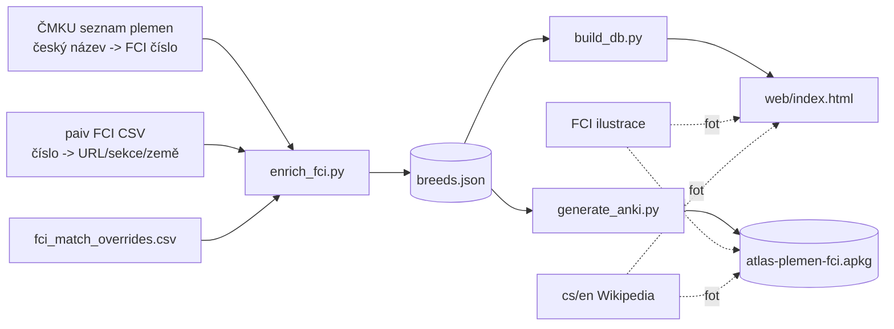

# Atlas plemen FCI

Studijní pomůcka pro kynologické zkoušky: kvíz (HTML) + Anki balíček, postavené
nad databází ~360 FCI plemen a běžných non-FCI plemen. Databáze je obohacená
o oficiální FCI čísla, ilustrace a odkazy na standardy.

- **Pro koho:** Lea Smrčková (příprava na kynologické zkoušky).
- **Co se učí:** všech ~360 FCI plemen (skupiny 1-10) plus non-FCI (skupina 11),
  jejich FCI skupina, sekce, varianty velikosti a srsti, země původu.

## Rychlý start

```bash
# 1. Virtuální prostředí + závislosti
python3 -m venv .venv
source .venv/bin/activate
pip install -e ".[dev]"        # nebo: pip install -r requirements.txt

# 2. Sestav kvíz z databáze (breeds.json -> web/index.html)
python src/build_db.py

# 3. Spusť kvíz lokálně
python -m http.server 8000 --directory web
#   otevři http://localhost:8000/

# 4. Vygeneruj Anki balíček (text-only je rychlý; bez --no-images stahuje fotky)
python anki/generate_anki.py --no-images        # -> dist/atlas-plemen-fci.apkg
```

## Struktura projektu

```
data/
  breeds.json              # kanonický zdroj pravdy (421 plemen)
  external/                # stažené autoritativní zdroje
    cmku-breeds.csv        #   ČMKU: český název -> FCI číslo
    fci-breeds-en.csv      #   paiv mirror FCI nomenklatury (EN)
    fci-breeds-fr.csv      #   tentýž zdroj (FR, pro křížovou kontrolu)
  fci_match_overrides.csv  # ruční id -> FCI číslo pro tvrdé případy
src/
  enrich_fci.py            # doplní FCI metadata do breeds.json
  build_db.py              # vloží breeds.json do šablony -> web/index.html
  photo_fetcher.py         # sdílená foto-cascade (FCI -> cs.wiki -> en.wiki)
web/
  template.html            # zdrojová šablona s __BREED_DATABASE__
  index.html               # vygenerovaný kvíz (servíruje se / deployuje)
anki/
  generate_anki.py         # generátor .apkg
schemas/
  breeds.schema.json       # JSON Schema (Draft 2020-12) pro breeds.json
tests/                     # pytest (46 testů)
reports/                   # generované reporty (gitignored krom open_questions.md)
dist/                      # build artefakty (gitignored)
```

## Workflow

### Rozšířit / opravit databázi
1. Uprav `data/breeds.json` (drž se schématu v `schemas/breeds.schema.json`).
2. Doplň FCI metadata: `python src/enrich_fci.py`
   - matchne plemena proti ČMKU a paiv CSV, zapíše FCI čísla a URL,
   - nesparovaná vypíše do `reports/unmatched.csv`,
   - souhrn do `reports/enrichment_summary.md`.
   - Pro tvrdé případy přidej řádek do `data/fci_match_overrides.csv`.
3. Ověř schéma: `python -m jsonschema -i data/breeds.json schemas/breeds.schema.json`
4. Sestav kvíz: `python src/build_db.py`
5. Přegeneruj Anki: `python anki/generate_anki.py`

### Ověřit / opravit české názvy
1. `python src/verify_cs_names.py` (rate-limited na 1 dotaz/s) zapíše
   `reports/cs_name_review.csv` (sloupec `cs_match`). Nic nepřepisuje.
2. Projdi report ručně, sporné opravy zapiš do `data/cs_overrides.csv`
   (sloupce: `id, cs_corrected, reason`).
3. `python src/apply_cs_overrides.py` přepíše `cs` v `breeds.json`
   (`--dry-run` pro náhled). Pak přegeneruj kvíz/Anki.

### Deploy na GitHub Pages
`.github/workflows/deploy.yml` při push na `main` sestaví `web/`
(`make_icons.py` + `build_db.py`) a publikuje na GitHub Pages. V repu zapni
Settings → Pages → Source: GitHub Actions.

### Foto-cascade
Pořadí zdrojů (kvíz i Anki používají stejnou logiku):
1. **oficiální FCI ilustrace** (`fci_illustration_url`, jen skupiny 1-10),
2. cs.wikipedia (český název, pak zjednodušený),
3. en.wikipedia (anglický název, pak zjednodušený).

Non-FCI plemena (skupina 11) jdou rovnou na Wikipedia cascade.

### Datové zdroje (diagram)



## Testy a kvalita

```bash
pytest --cov --cov-report=term-missing     # 46 testů, src/ ~88 %
ruff check src anki tests                   # lint
python -m jsonschema -i data/breeds.json schemas/breeds.schema.json
```

CI (`.github/workflows/ci.yml`) spouští lint, validaci schématu a testy.
Pre-commit (`pre-commit install`) přidává ruff + validaci schématu lokálně.

## Credits a licence

- **Data o plemenech:** odvozeno z [ČMKU](https://www.cmku.cz/) oficiálního
  rozdělení a [paiv/fci-breeds](https://github.com/paiv/fci-breeds) (mirror
  FCI nomenklatury).
- **FCI ilustrace a standardy:** © [FCI](https://www.fci.be/), odkazované
  pro vzdělávací účely.
- **Fotky z Wikipedie:** CC-BY-SA, autoři jednotlivých článků.

Kód: MIT. Data respektují licence původních zdrojů.
